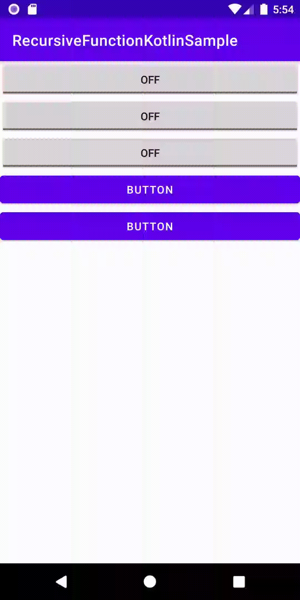

# Project Overview
Sample for Click listener Registration by recursive function

# Development environment

# implementation
Only ToggleButton is registered as a click listener.

# capture

# For Java code
https://github.com/LeoAndo/android-recursive-function-samples/tree/main/RecursiveFunctionJavaSample

# For Kotlin code
https://github.com/LeoAndo/android-recursive-function-samples/tree/main/RecursiveFunctionKotlinSample

# livecoding
https://youtu.be/rHHpxsn9Td8

